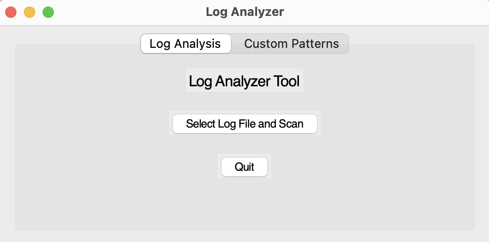

# Log Analyzer Tool

The Log Analyzer Tool is a Python-based application designed to help you analyze log files for suspicious activities. It supports detection of malware, file tampering, unauthorized access, and security breaches. The tool works on macOS, Windows, and Linux.

## Features

- Analyze log files for various suspicious activities.
- Provides recommended actions for detected issues.
- Generates a graphical visualization of detected issues.
- Allows users to send the analysis report via email.

## Requirements

- Python 3.x
- Required Python libraries:
  - `matplotlib`
  - `tkinter` (macOS and Linux only)
  - `numpy`

## Installation

### For macOS and Linux

1. Ensure Python 3.x is installed. If not, install it:

    ```bash
    sudo apt-get install python3 python3-pip   # For Debian-based systems
    sudo pacman -S python python-pip          # For Arch-based systems
    brew install python                       # For macOS using Homebrew
    ```

2. Install the required libraries:

    ```bash
    pip3 install -r requirements.txt
    ```

3. If `tkinter` is not installed, install it via this command:

    ```bash
    sudo apt-get install python3-tk           # For Debian-based systems
    sudo pacman -S tk                         # For Arch-based systems
    ```

### For Windows

1. Ensure Python 3.x is installed. If not, download and install it from the [official website](https://www.python.org/downloads/).

2. Install the required libraries:

    ```bash
    pip3 install -r requirements.txt
    ```

## Usage

1. Run the application:

    ```bash
    python log_analyser.py
    ```

2. Browse and select the log file you want to analyze.

3. After the analysis is complete, you will get the output of the scan.

## Example

Here is an example usage of the tool:



After selecting a log file and running the analysis, you will see the detected issues and recommended actions with a bar graph.

## Future Enhancements

- **Real-time Monitoring**: Implement real-time monitoring of log files to detect suspicious activities as they happen.
- **Custom Patterns**: Allow users to define custom patterns and rules for detecting suspicious activities.
- **Integration with SIEM**: Integrate with Security Information and Event Management (SIEM) systems for advanced threat detection and incident response.
- **Multi-format Log Support**: Support for additional log formats and sources.

  
